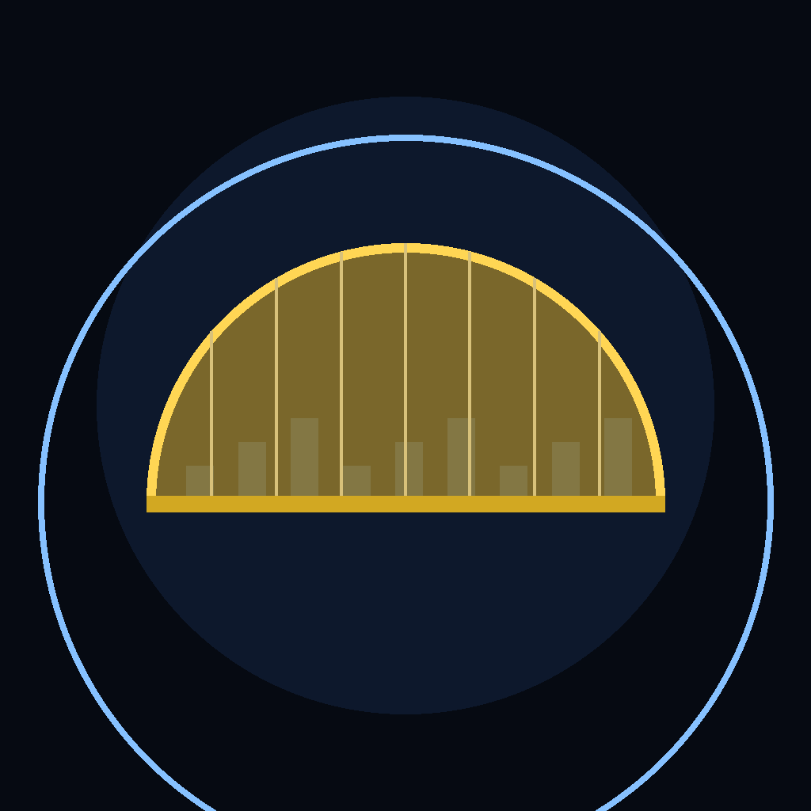

<p align="center">
  
</p>

<h1 align="center">DomeBreak</h1>

<p align="center">
  <b>A real-time strategy missile game played on the living world map.</b>
</p>
<p align="center">
  Pick a nation, build an arsenal of silos, interceptors, warships and jets,<br />
  and out-launch, out-build, and out-defend the AI — one DomeBreak at a time.
</p>

<p align="center">
  
  
  
  
  
</p>

<br />

## Why DomeBreak

Most nuke-'em games flatten the planet to an abstract grid. DomeBreak keeps the real one — a MapLibre GL world map with
actual cities, coastlines, and borders — and turns it into the board. You command a single nation in a real-time
exchange against AI rivals: place defenses over your cities, mass offensive systems at the front, out-produce your
rivals, and manage a war economy while missiles are already in the air. When your DomeBreak holds and theirs doesn't,
you win.

<table width="100%">
  <tr>
    <td width="33%" valign="top">
      <h3 align="center">The whole planet is the board</h3>
      <p align="center">Choose any real nation and fight on a MapLibre GL + PMTiles world map — globe or flat, real cities, real borders, backed by a real-world tile map.</p>
    </td>
    <td width="33%" valign="top">
      <h3 align="center">A full arsenal</h3>
      <p align="center">Land, sea, air, ground, and space — SAM batteries, missile silos, hypersonics, warships, submarines, and an orbital tier — firing everything from conventional rounds to thermonuclear MIRVs.</p>
    </td>
    <td width="33%" valign="top">
      <h3 align="center">Out-build, out-economy</h3>
      <p align="center">A guided objective ladder from first command bunker to first-strike force, a city-vitality war economy with upkeep, live diplomacy, and continuous autosave — all simulated in real time at up to 10× speed.</p>
    </td>
  </tr>
</table>

<br />

## Play

```bash
npm install
npm run dev      # http://localhost:5173
```

Open the dev server, start a **New Game**, pick your nation and the number of AI opponents, and command your arsenal on
the map. Progress autosaves to local storage; **Continue** picks up where you left off.

## Build

```bash
npm run build            # production web build (the release gate)
npm run preview          # preview the production build
npm run lint             # eslint
npm test                 # vitest suite

npm run electron         # run the desktop shell against the build
npm run electron:build:mac   # package a macOS .dmg
npm run electron:build:win   # package a Windows installer
npm run electron:build:all   # package macOS + Windows
```

## How it works

- The game runs a **pure, deterministic real-time simulation** (`src/game/engine.js`), driven by an animation-frame loop
  in `useEngine` and mutated in place — no server needed for single-player.
- **Defenses roll intercepts by range and probability.** A radar or AWACS in range links to nearby launchers to extend
  their reach (`RADAR_RANGE_MULT`), so early warning is worth as much as raw firepower.
- **Offense is munitions-limited.** Silos and launchers fire warheads you produce — cheap standard rounds, splash-damage
  cluster munitions, or slow, expensive city-killer thermonuclear yields.
- **Economy runs on city vitality.** Each city's income, population, and industrial capacity scale with its remaining
  health, so bombing a rival's cities strangles their war machine while unit upkeep drains your own points.
- A **server-authoritative multiplayer backend** ships in the repo — an authoritative Node game server imports the same
  engine, claims Supabase lobbies, and streams full-world snapshots over WebSockets so every client agrees on the match.
  Releases are version-locked: the server only admits clients on its exact build version (`src/net/version.js`), and
  outdated clients are prompted in-game to update — the desktop app downloads the new installer and reinstalls itself
  in place (`electron/updater.cjs`), with the website download as a manual fallback.

## Arsenal

| Domain              | Systems                                                                                                                                       |
|:--------------------|:----------------------------------------------------------------------------------------------------------------------------------------------|
| **Land — defense**  | SAM battery, plus Patriot, Aegis Ashore, and THAAD batteries                                                                                   |
| **Land — strike**   | Hypersonic launcher, missile silo (ICBM), and the hypersonic missile battery — each firing selectable warheads                                 |
| **Sensors**         | Early-warning radar, over-the-horizon radar, airborne AEW&C, and orbital reconnaissance / missile-warning satellites                           |
| **Ground forces**   | Army base, infantry, artillery, tank battalions, and attack / transport helicopters                                                           |
| **Sea**             | Missile cruiser, destroyer (ASW), battleship, aircraft carrier, plus SSN / SSBN submarines and amphibious transports                           |
| **Air**             | Multirole, strike, air-superiority, and carrier fighters, close air support, transport, and AEW&C — flown from airstrips and carriers as wings |
| **Space**           | Behind a Space Command HQ: a reconnaissance satellite and an orbital strike platform                                                           |
| **Warheads**        | Conventional, cluster (MIRV splash), hypersonic glide, thermonuclear city-killer, road-mobile SICBM, and thermonuclear MIRV — each produced against its own cost and build time |

## Objectives

You aren't dropped in cold. An ordered ladder of strategic objectives — shown in the in-game Objectives panel — walks
you from standing up command authority to fielding a first-strike force. Each step completes as you build the structures
it calls for, so the early game has a clear shape while you learn the map.

| Objective             | Goal                                                        |
|:----------------------|:------------------------------------------------------------|
| **Establish Command** | Stand up national command authority and forward air power.  |
| **Early Warning Net** | Blanket your own territory in radar coverage.               |
| **Industrial Base**   | Grow the war economy that pays for everything else.         |
| **Point Defense**     | Ring your cities with layered surface-to-air fire.          |
| **Missile Shield**    | Stand up mid-course and terminal ballistic-missile defense. |
| **Strike Force**      | Field the offensive missiles to threaten a first strike.    |

## Stack

- **Client** — React 19 + Vite 7, rendered over MapLibre GL and `react-map-gl`, with PMTiles tiles read client-side.
  Flags via `flag-icons`.
- **Desktop** — an Electron 33 shell (`electron/main.cjs`), packaged for macOS, Windows, and Linux with
  `electron-builder`.
- **Multiplayer backend** — Supabase (Auth, Postgres, and the Deno edge functions `db-account`, `db-lobby`, `db-match`,
  `db-party`, `db-social`, and `db-waitlist`) plus an authoritative Node game server (`server/`) that imports the same
  engine and runs live matches over WebSockets. Configure the client with `VITE_SUPABASE_URL` and
  `VITE_SUPABASE_ANON_KEY` (see `.env.example`).

## Attribution

The interactive world map is a MapLibre + PMTiles renderer with region/country/city tile layers. Unit icons are
from [game-icons.net](https://game-icons.net) (Lorc, Delapouite) under CC BY 3.0.

## License

Authored by **Trenton Taylor**. Reused game-icons.net icons retain their upstream license noted above; the
repository does not yet ship its own license file.

<br />

<p align="center">
  <sub>Build the dome. Hold the line. When the clock runs out, the missiles fly.</sub>
</p>
