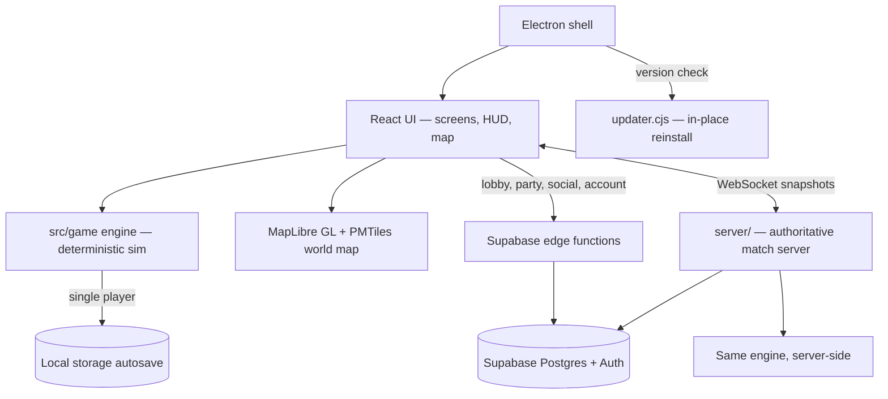

<p align="center">
  
</p>

<h1 align="center">DomeBreak</h1>

<p align="center">
  <b>A real-time strategy missile game played on the living world map.</b>
</p>
<p align="center">
  Pick a nation, build an arsenal of silos, interceptors, warships and jets,<br />
  and out-launch, out-build, and out-defend your rivals — one DomeBreak at a time.
</p>

<p align="center">
  
  
  
  
  
  
</p>

<br />

## Why DomeBreak

Most nuke-'em games flatten the planet to an abstract grid. DomeBreak keeps the real one — a MapLibre GL world map with actual cities, coastlines, and borders — and turns it into the board. You command a single nation in a real-time exchange: place defenses over your cities, mass offensive systems at the front, out-produce your rivals, and manage a war economy while missiles are already in the air. When your dome holds and theirs doesn't, you win.

<table width="100%">
  <tr>
    <td width="33%" valign="top">
      <h3 align="center">The whole planet is the board</h3>
      <p align="center">Choose any real nation and fight on a MapLibre GL + PMTiles world map — globe or flat, real cities, real borders.</p>
    </td>
    <td width="33%" valign="top">
      <h3 align="center">A full arsenal</h3>
      <p align="center">Land, sea, air, ground, and space — SAM batteries, silos, hypersonics, warships, submarines, and an orbital tier — firing everything from conventional rounds to thermonuclear MIRVs.</p>
    </td>
    <td width="33%" valign="top">
      <h3 align="center">Out-build, out-economy</h3>
      <p align="center">A guided objective ladder, a city-vitality war economy with upkeep, live diplomacy, and continuous autosave — simulated in real time at up to 10× speed.</p>
    </td>
  </tr>
</table>

<br />

## Stack

| Layer | Technology |
| :--- | :--- |
| UI | React 19 + Radix UI primitives, Tailwind CSS 4 |
| Build & dev | Vite 7 |
| Map | MapLibre GL + `react-map-gl`, PMTiles read client-side; flags via `flag-icons` |
| Simulation | Pure deterministic engine in `src/game`, driven by an animation-frame loop |
| Desktop | Electron 33 shell, packaged with `electron-builder` for macOS, Windows, and Linux |
| Backend | Supabase — Auth, Postgres, and seven Deno edge functions |
| Match server | Authoritative Node server in `server/`, importing the same engine over WebSockets |
| Charts | Recharts |
| Testing | Vitest |

## Getting started

```bash
npm install
npm run dev           # http://localhost:5173
npm run build         # production web build — the release gate
```

Start a **New Game**, pick your nation and how many AI opponents you face — optionally hand-picking which nations they are — and command your arsenal on the map. Progress autosaves to local storage; **Continue** picks up where you left off.

Copy `.env.example` to `.env` for the multiplayer backend. Single-player needs no configuration.

| Variable | Purpose |
| :--- | :--- |
| `VITE_SUPABASE_URL` | Supabase project URL. |
| `VITE_SUPABASE_ANON_KEY` | Supabase publishable key for the browser client. |
| `VITE_UPDATE_URL` | Optional override for the published-version endpoint the update check polls. Defaults to `https://domebreak.com/version.json`. |

### Scripts

| Script | Does |
| :--- | :--- |
| `npm run dev` | Start the Vite dev server. |
| `npm run build` | Production web build to `dist/`. |
| `npm run preview` | Serve the production build locally. |
| `npm test` | Run the Vitest suite. |
| `npm run lint` | Lint with ESLint. |
| `npm run electron` | Run the desktop shell against the build. |
| `npm run electron:build:mac` | Package a macOS `.dmg` (arm64 + x64). |
| `npm run electron:build:win` | Package a Windows NSIS installer. |
| `npm run electron:build:all` | Package macOS and Windows together. |
| `npm run brand:dev-electron` | Re-apply the dev branding to the local Electron binary. Also runs on `postinstall`. |

`electron-builder` writes to `release/`, and a Linux `AppImage` target is configured for anyone who wants to build one by hand.

## Architecture



## How it works

- **The simulation is pure and deterministic.** `src/game/engine.js` is mutated in place by an animation-frame loop in `useEngine` — single-player needs no server at all.
- **Defenses roll intercepts by range and probability.** A radar or AWACS in range links to nearby launchers to extend their reach (`RADAR_RANGE_MULT`), so early warning is worth as much as raw firepower.
- **Offense is munitions-limited.** Silos and launchers fire warheads you produce — cheap standard rounds, splash-damage cluster munitions, or slow, expensive city-killer thermonuclear yields.
- **Economy runs on city vitality.** Each city's income, population, and industrial capacity scale with its remaining health, so bombing a rival's cities strangles their war machine while unit upkeep drains your own points.
- **Multiplayer is server-authoritative.** The Node server in `server/` imports the same engine, claims Supabase lobbies, and streams full-world snapshots over WebSockets so every client agrees on the match.
- **Releases are version-locked.** The server only admits clients on its exact build version (`src/net/version.js`); outdated clients are prompted in-game, and the desktop app downloads the new installer and reinstalls itself in place (`electron/updater.cjs`), with the website download as a manual fallback.

## Arsenal

| Domain | Systems |
| :--- | :--- |
| **Land — defense** | SAM battery, Mobile SHORAD, close-in C-RAM, plus Patriot, Aegis Ashore, THAAD, and a directed-energy Laser Defense Grid |
| **Land — strike** | Road-mobile TEL (SICBM), missile silo (ICBM), and the hypersonic missile battery — the silo loading any warhead from conventional to thermonuclear MIRV |
| **Sensors** | Early-warning radar, over-the-horizon radar, airborne AEW&C, and orbital reconnaissance / missile-warning satellites |
| **Ground forces** | Army base, infantry, artillery, tank battalions, and attack / transport helicopters |
| **Sea** | Missile cruiser, destroyer (ASW), battleship, aircraft carrier, plus SSN / SSBN submarines and amphibious transports |
| **Air** | Multirole, strike, air-superiority, and carrier fighters, close air support, the strategic bomber, transport, and AEW&C — flown from airstrips and carriers as wings |
| **Space** | Behind a Space Command HQ: a reconnaissance satellite and an orbital strike platform |
| **Warheads** | Conventional, cluster (MIRV splash), hypersonic glide, thermonuclear city-killer, road-mobile SICBM, and thermonuclear MIRV — each produced against its own cost and build time |

## Objectives

An ordered ladder of strategic objectives — shown in the in-game Objectives panel — walks you from standing up command authority to fielding a first-strike force. Each step completes as you build the structures it calls for.

| Objective | Goal |
| :--- | :--- |
| **Establish Command** | Stand up national command authority and forward air power. |
| **Early Warning Net** | Blanket your own territory in radar coverage. |
| **Industrial Base** | Grow the war economy that pays for everything else. |
| **Point Defense** | Ring your cities with layered surface-to-air fire. |
| **Missile Shield** | Stand up mid-course and terminal ballistic-missile defense. |
| **Strike Force** | Field the offensive missiles to threaten a first strike. |

## Project structure

```
domebreak/
├── build/                     Electron icon + afterPack hook
├── electron/                  Desktop shell (main.cjs) and in-place updater
├── public/
│   ├── assets/, brand/, data/, icons/
├── scripts/                   Dev branding, dist/ship + deploy shells, map-data
│                              generators, AI soak harness
├── server/                    Authoritative Node match server + matchmaker
├── supabase/
│   ├── functions/             db-account, db-beta, db-lobby, db-match, db-party,
│   │                          db-social, db-waitlist
│   └── migrations/            Schema DDL
├── tests/unit/                Vitest suites — ai, combat, economy, naval, net, objectives,
│                              matchmaking, leadership, stability, electron, ui, …
├── web/                       Separate marketing landing page with waitlist capture
└── src/
    ├── game/                  engine.js + data, geo, platform, sim
    ├── map/                   MapLibre + PMTiles layers
    ├── net/                   Client networking + version lock
    ├── account/               Auth and profile
    ├── ui/                    screens, hud, live, common, hooks
    └── lib/                   Shared helpers and hooks
```

## Attribution

The interactive world map is a MapLibre + PMTiles renderer with region, country, and city tile layers. Unit icons are from [game-icons.net](https://game-icons.net) (Lorc, Delapouite) under CC BY 3.0.

## License

Authored by **Trenton Taylor**. Reused game-icons.net icons retain their upstream license noted above; the repository does not yet ship its own license file.

<br />

<p align="center">
  <sub>Build the dome. Hold the line. When the clock runs out, the missiles fly.</sub>
</p>
